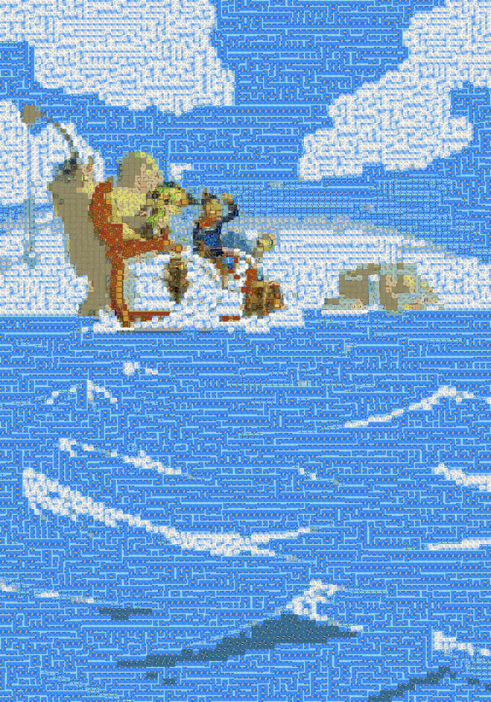

# Zelda Mosaic

[Presentation with example outputs](https://docs.google.com/presentation/d/1pOzki3GlRsiua_MD8mwf67SO_FFPxYRida6s8g2tFxs/edit?usp=sharing)

For UNC Comp 572 Fall 2020.

Key-art from which mosaics were created available on request.

- [mat2tiles](https://www.mathworks.com/matlabcentral/fileexchange/35085-mat2tiles-divide-array-into-equal-sized-sub-arrays):
  License is `mat2tiles/license.txt`

As expected, smaller block sizes look better. These are 25x25 pixel blocks:

